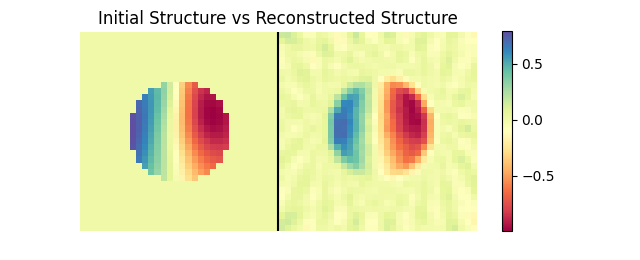
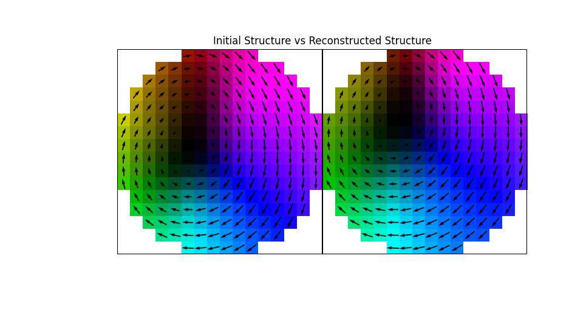
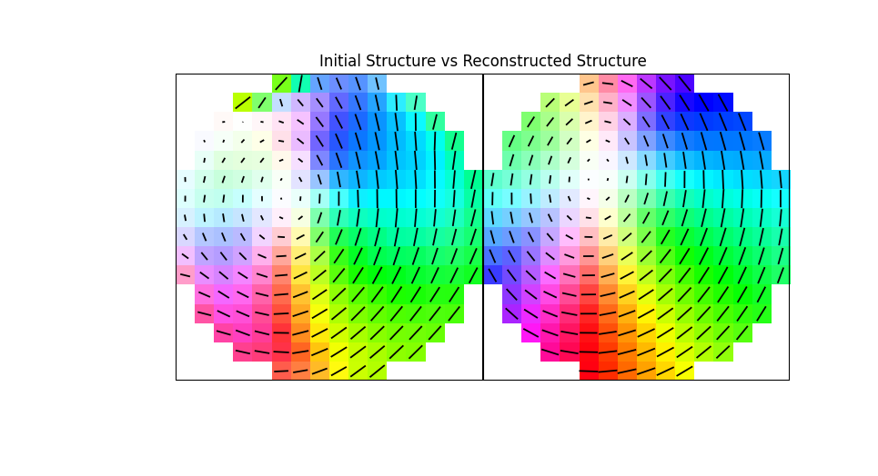

Getting Started
===============

Installation
------------

To use magtomo, first install it using pip:

.. code-block:: console

   (.venv) $ pip install magtomo

Examples
--------
The examples included here are lightweight demonstrations, making use of a small array (32, 64, 32) and 72 projections
to produce vector and orientation reconstructions (18 projections for scalar reconstruction).

.. _scalar_tomo_ex:

Scalar Tomography
^^^^^^^^^^^^^^^^^
The :func:`magtomo.examples.scalar_tomo` function performs an example 3D scalar reconstruction. First, projections are
collected as the sample is rotated around the *y* axis according to the provided angles. Then, the projections are used
to call the inversion function, recovering the initial structure

.. code-block:: python

    # calculated projections for the 3D structure
    # at the desired angles creates projections
    projections = radon(struct, angles)
    # uses the projections (and angles at which
    # the projections were taken) to recover the initial structure
    recons = inv_radon(projections, angles)

A comparison of the initial and reconstructed structures is shown below (obtained with 18 total projections). More
projections can be used for improved reconstruction quality.

.. _vector_tomo_ex:

Vector Tomography (XMCD)
^^^^^^^^^^^^^^^^^^^^^^^^
In vector tomography (in this case x-ray magnetic circular dichroic tomography), using circularly polarized light gives
access to the component of the magnetization parallel or anti-parallel to the beam. To simulate projections from a
structure, an :class:`magtomo.Experiment.Experiment` class is created.

The polarization, an argument for the class constructor, determines the type of interaction. Circularly polarized light
is indicated with complex ``1j`` (circular left) and ``-1j`` (circular right). The exam

The :func:`magtomo.examples.vector_tomo` function performs an example 3D vector or orientation tomographic
reconstruction. The process is similar to :ref:`scalar_tomo_ex`; appropriate projections are calculated and then used
as input for the reconstruction. For simulating dichroic tomography experiments, projections are calculated using the
:class:`magtomo.Experiment.Experiment` class and reconstructed with the :class:`magtomo.Reconstruction.Reconstruction`
class.

.. code-block:: python

    # create experiment class, defining the rotations and polarizations
    exp = Experiment(magnetization=struct, rotations=rot, pol=pol)
    exp.calculate_sinogram()    # calculate the projections
    projections = exp.sinogram  # get the projections to be used an input

    # create a reconstruction class
    recons = Reconstruction(initial_guess, rotations=rot, projections=projections,
                            pol=pol, mask=mask)
    recons.reconstruct()        # reconstruct (iterative gradient descent)

A comparison of the initial and reconstructed structure is shown below (obtained with 72 total projections). More
projections and tilts can be used for improving the reconstruction quality.

Orientation Tomography (XMLD)
^^^^^^^^^^^^^^^^^^^^^^^^^^^^^
In orientation tomography linearly polarized light is used to gain information about the orientation of charge and
magnetic anisotropies. Linearly polarized light can take integer values corresponding to the angle between the *x* axis
and the polarization. As before, Projections are simulated using the :class:`magtomo.Experiment.Experiment` class and
subsequently reconstructed using the :class:`magtomo.Reconstruction.Reconstruction` class.

In this example, two polarization are used, :math:`\pm45^\circ` and two tilt axes, :math:`\pm30^\circ`. The same process
as the one outlined in :ref:`vector_tomo_ex` is followed with a different ``dichroism`` option when calling the
:func:`magtomo.examples.vector_tomo` function.

.. code-block:: python

    dichroism = 'LD'  # circular ('CD') or linear ('LD')

A comparison of the initial and reconstructed structures is shown below (obtained with 72 total projections). More
projections and tilts can be used for improving the reconstruction quality.

Orientation tomography generally requires more iterations for a successful reconstruction  and is best performed with
GPU acceleration. See code in |xldot| for MATLAB version.

.. |xldot| raw:: html

   <a href="https://doi.org/10.1038/s41586-024-08233-y"><i>Nature</i> <b>636</b> 354</a>

Full Code
^^^^^^^^^

The full code from the ``examples.py`` file can be seen here:

.. raw:: html

    

    
<a>View Code</a>

.. include:: ../../magtomo/examples.py
    :literal:

.. raw:: html

   
